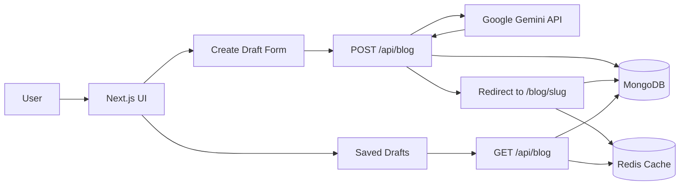
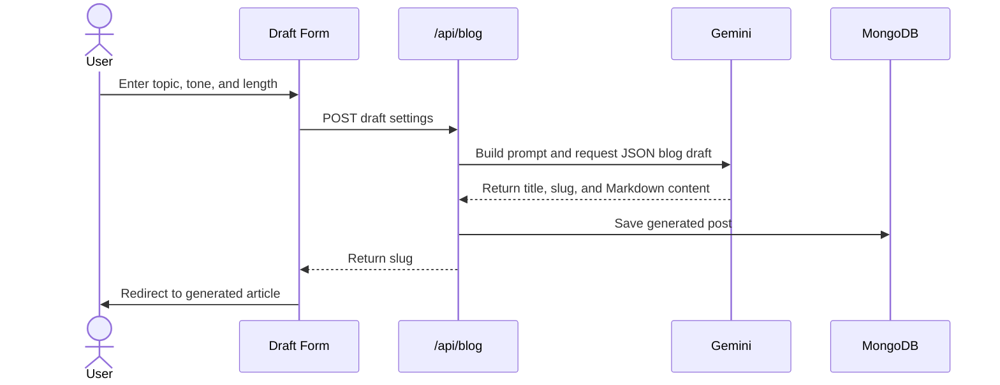
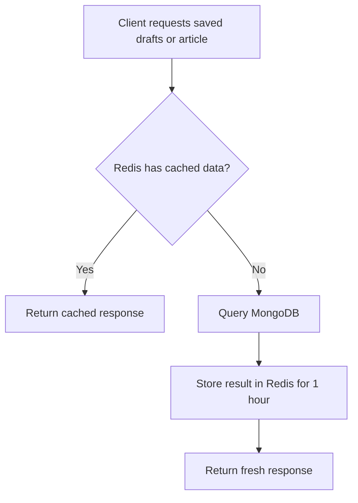
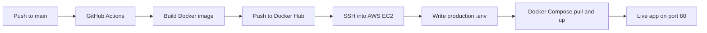

# Blogify - AI Blog Automation Platform

Blogify is a full-stack AI writing app that turns a topic, tone, and target length into a saved Markdown blog draft. It combines a Next.js interface, Gemini-powered content generation, MongoDB persistence, Redis caching, Docker packaging, and an automated GitHub Actions deployment path to AWS EC2.

Built as a practical end-to-end project: prompt in, article out, cached and ready to share.

## Highlights

- AI blog generation with Google Gemini
- Tone and length controls for draft shaping
- Markdown rendering with GitHub-flavored Markdown support
- MongoDB storage for generated posts
- Redis caching for blog lists and article detail pages
- App Router pages and API routes in Next.js 13
- Dockerized production build
- GitHub Actions workflow for Docker Hub and EC2 deployment
- Zod-based environment validation

## Tech Stack

| Layer | Tools |
| --- | --- |
| Frontend | Next.js, React, Tailwind CSS |
| API | Next.js Route Handlers |
| AI | Google Gemini via `@google/genai` |
| Database | MongoDB, Mongoose |
| Cache | Redis |
| Validation | Zod |
| Deployment | Docker, Docker Compose, GitHub Actions, AWS EC2 |

## Architecture



## Blog Generation Flow



## Cache Strategy



## Deployment Pipeline



## Core Routes

| Route | Purpose |
| --- | --- |
| `/` | Landing workspace with saved generated drafts |
| `/create` | Draft creation form |
| `/blog/[slug]` | Generated blog detail page |
| `/api/blog` | Creates drafts and lists saved posts |

## Project Structure

```text
BLOG-AUTOMATION/
+-- app/
|   +-- api/blog/route.js       # Blog create/list API
|   +-- blog/[slug]/page.jsx    # Generated article page
|   +-- create/page.jsx         # Draft creation page
|   +-- page.js                 # Home and draft list
+-- components/
|   +-- form.jsx                # Topic/tone/length form
|   +-- blogList.jsx            # Saved drafts grid
|   +-- BlogDetails.jsx         # Markdown article renderer
+-- helper/openai.js            # Gemini blog generation helper
+-- lib/
|   +-- blogService.js          # Cached article lookup
|   +-- database.js             # MongoDB connection
|   +-- env.js                  # Zod env validation
|   +-- redis.js                # Redis client
+-- models/blog.js              # Blog schema
+-- Dockerfile
+-- docker-compose.yml
+-- .github/workflows/deploy.yml
```

## Environment Variables

Create a `.env` file in the project root:

```env
MONGO_DB_URI=your_mongodb_connection_string
GEMINI=your_gemini_api_key
REDIS_HOST=your_redis_host
REDIS_PORT=your_redis_port
REDIS_PASSWORD=your_redis_password
DOCKERHUB_USERNAME=your_dockerhub_username
```

## Run Locally

```bash
npm install
npm run dev
```

Open:

```text
http://localhost:3000
```

## Production Build

```bash
npm run build
npm start
```

## Run with Docker

```bash
docker build -t blogify .
docker run --env-file .env -p 3000:3000 blogify
```

Or with Docker Compose:

```bash
docker compose up -d
```

## What Makes This Project Worth Sharing

This project is not just a UI around an AI API. It shows the full product loop:

- Prompt engineering for structured JSON output
- Server-side validation and failure handling
- Persistent content storage
- Redis-backed performance optimization
- Markdown rendering for generated long-form content
- Containerized deployment
- CI/CD from GitHub to a cloud VM

## LinkedIn Post Draft

I built Blogify, an AI-powered blog automation platform that turns a topic, tone, and length into a saved Markdown article.

The project combines Next.js, Gemini, MongoDB, Redis, Docker, GitHub Actions, and AWS EC2. I wanted to go beyond a simple AI demo, so I added real persistence, caching, environment validation, containerized deployment, and a CI/CD pipeline.

The best part was wiring the full flow: user input -> AI structured JSON response -> MongoDB save -> Redis cache -> generated article page.

This helped me practice building AI features as production-style systems, not just prompts in a textbox.

## Future Improvements

- Add authentication and private workspaces
- Add draft editing before publishing
- Add cache invalidation after creating a new post
- Add image generation for blog hero assets
- Add SEO metadata controls per article
- Add test coverage for API and service logic
